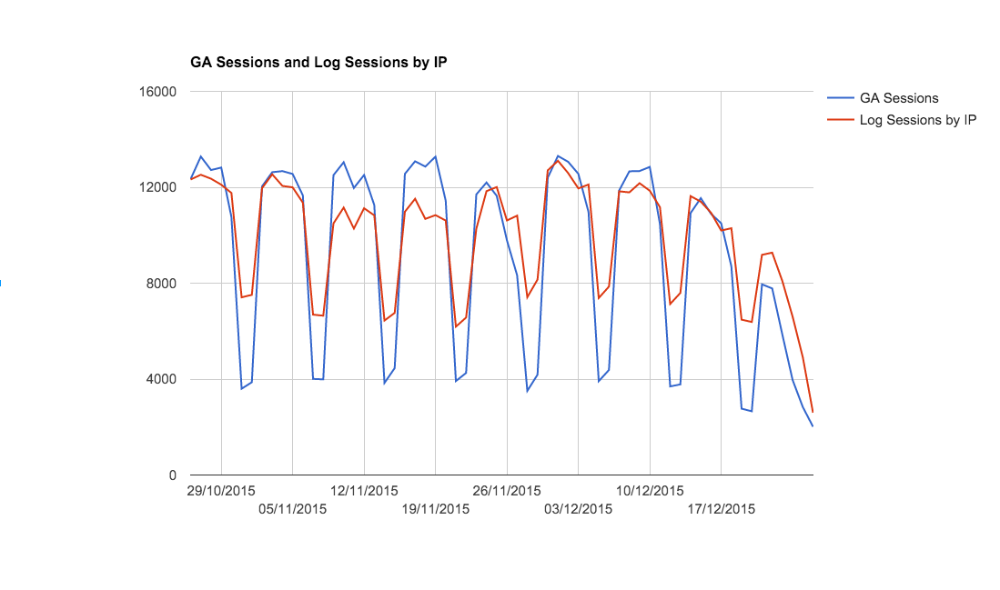
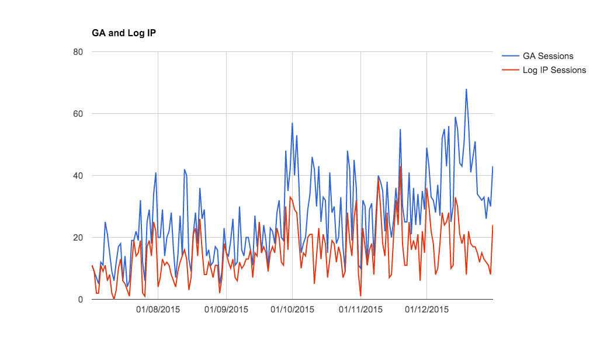

# Web Sessions computed using Web Server Logs 

(This project is under development)

The aim of this project is to compare Google Analytics / Piwik Sessions versus sessions that could be computed analysing web server logs.

Google Analytics states that (simpler version) : A session is a group of interactions that take place on your website within a given time frame. A single user can open multiple sessions. Those sessions can occur on the same day, or over several days, weeks, or months. 
As soon as one session ends, there is then an opportunity to start a new session. 

A sessions ends when:
* After 30 minutes of inactivity (this value can be changed, but by default it's 30minutes)
* At midnight

Source: https://support.google.com/analytics/answer/2731565?hl=en

Piwik has a similar definition for visit:
http://piwik.org/faq/general/faq_36/

# Implementation details ...

# Results

"Normal" HTML website

"Angular" website (single page application with partials)

# Visits/Sessions

Measuring visits (aka GA sessions) has some advantages compared to hits when we want to measure usage statistics:
* The metric is not dependent on the technology used to build the website. For example a SPA (Single Page Application) may have many partials (html files) to build one single page. It can therefore generate plenty of hits on the server side, but will generate only one session (which is more correct in term of usage statistics). On the other side, if a site is build with basic 1 basic HTML file, only one hit will be generated on the server side. Those websites have the same "usage", but the hits can differ a lot, while the number of visits are the same.

* Other dependent resources used to build the pages like images, css/js files, ... won't biase the number of sessions, because they all are part of the same session. But they will surely biase hits, and it is sometimes difficult to agree what is a dependant resource and what is not (only looking at the logs).

* It increases if unique IPs increases. In term of usage statistics it's better to have 2 users acccessing the same resource, rather than 1 user accessing 2 pages. Hits won't reflect this information.

* It's less affected by the cache configuration. If a cache (based on expiration time) of 5minutes is defined and session is set to 30minutes sliding time window, then the number of visits will be the same. While the number of hits can decrease a lot.

* As well as hits, it captures other data access like txt, xml, json data access (that are not caugh by Google Analytics)

# Consideration

Caches ...
